# RunBuoy 宣传设计参考与落地建议

采集日期：2026-10-02。实际查看了 5 个产品的官网、4 个产品的美国区 iPhone App Store 展示、Pushcut 教程和 Structured 官方链接的媒体素材包。以下“值得借鉴”是对信息表达、构图和使用门槛的设计判断；本次没有这些页面的转化数据，也未安装测试参考产品。

建议以 **Chirp 的场景表达、Flighty 的状态呈现、Structured 的截图构图** 为主要参考；Pushcut 用于教程结构，Working Copy 用于开发者文案。RunBuoy 继续沿用自己的浅色、蓝紫主色和浮标图标。

| 参考 | 与 RunBuoy 的关系 | 最值得学的部分 | 使用边界 |
| --- | --- | --- | --- |
| Chirp | 很接近：脚本、服务、Agent 状态送到 iPhone | 先讲“任务在哪里运行、状态在哪里看到”，再讲技术接入 | 本轮没有确认其 App Store 正式上架状态；文档有 preview 标识 |
| Flighty | 同样把外部事件的持续状态带到手机 | 状态变化带来的安心感、锁屏和灵动岛局部放大 | 航班领域、成熟品牌；奖项和评价不能照搬 |
| Structured | 原生效率 App，适合看宣传图构图 | 大标题、单一主题、界面局部、统一视觉 | 规划与 AI 功能不是 RunBuoy 的能力 |
| Pushcut | 技术服务连接手机通知 | 按场景组织教程，分步骤直到看见结果 | 其远程动作能力不等于 RunBuoy 的只读状态能力 |
| Working Copy | 面向开发者的 iOS 工具 | 熟悉的工作流词汇、具体动作、真实产品演示 | 官网视觉较朴素，适合参考表达和演示，不作为主视觉模板 |

**1. Chirp：最接近的定位和官网场景参考**

[官网](https://www.chirpapp.dev/) · [文档](https://www.chirpapp.dev/docs/)

其首屏直接说清楚“从脚本、服务、Agent 到 iPhone 锁屏”，并列出备份、部署、模型训练等具体场景。下一屏用来源节点连接手机，把跨设备关系画出来。对第一次听说 RunBuoy 的人，这比先解释 CLI、MCP、APNs 更容易理解。

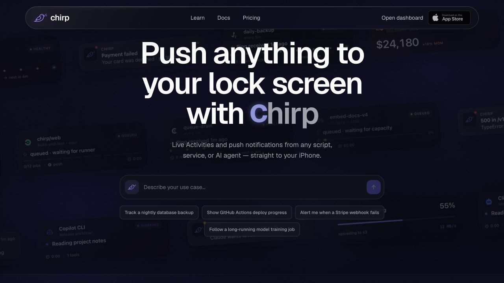

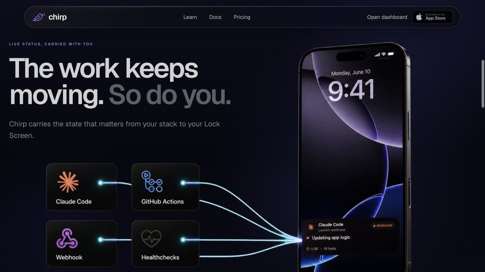

可以迁移到 RunBuoy 的做法：

- 首屏用一句收益明确的中文：**离开电脑，也知道任务跑到哪了。**
- 用“训练实验 / 构建脚本 / 数据处理与备份”作为场景入口。点开后分别说明可以显示哪些状态、怎样接入。
- 画出“Mac 或 Linux 上的任务 → RunBuoy → iPhone 锁屏”的关系；放一条具体任务，而不是抽象仪表盘。
- 主按钮直接下载 iPhone App，次按钮进入连接电脑教程。

Chirp 的暗色动态背景在本次画面里会削弱副文案对比；首屏输入框也要求访客先描述需求。RunBuoy 当前更需要清楚的下载和连接路径，可以直接采用场景卡片。本轮页面上的 App Store 图形没有提供可确认的外跳链接，文档又标有 preview，因此将其视为**定位与视觉参考**，不据此声称它有成熟的商店转化效果。

**2. Flighty：最值得参考的状态价值和 Live Activity 构图**

[官网](https://flighty.com/) · [App Store](https://apps.apple.com/us/app/flighty-live-flight-tracker/id1358823008) · [Apple 官方设计访谈](https://developer.apple.com/news/?id=970ncww4)

官网围绕“及时知道发生了什么”组织内容，并用实际通知事件作证据。Apple 官方访谈确认其获得 Apple Design Award，特别讨论了 Live Activities 与 Dynamic Island 如何持续提供关键信息。

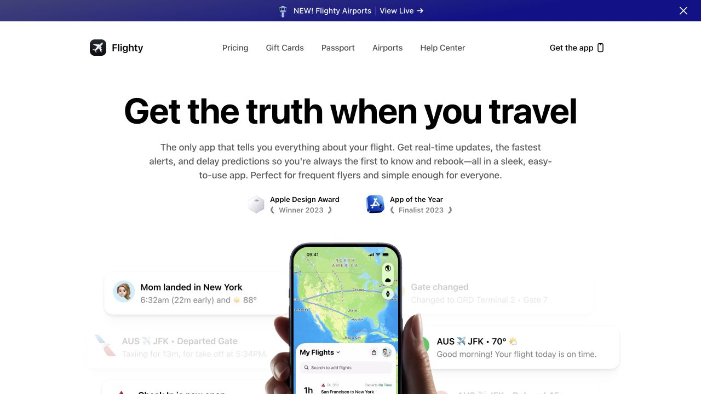

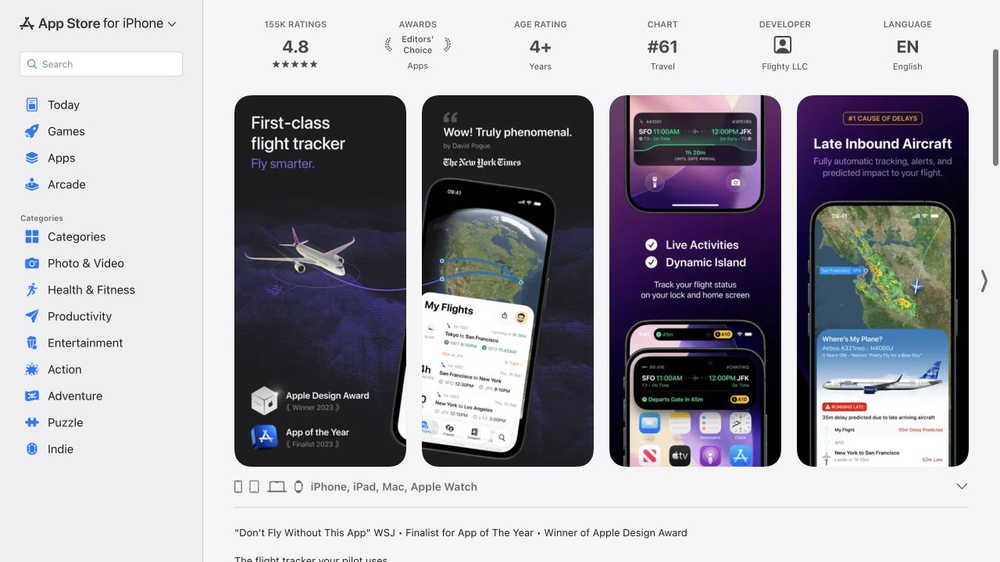

它的 Live Activities 宣传图把锁屏卡片与灵动岛分别放大，整机只保留必要的边框和上下文。用户可以直接阅读状态内容，手机壁纸不会成为主体。

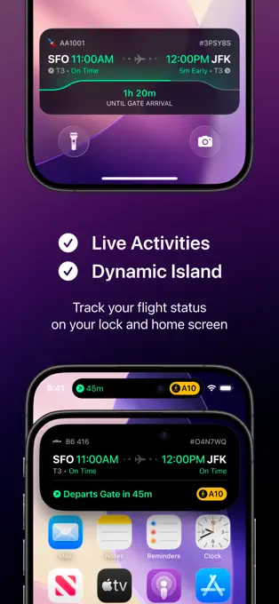

对 RunBuoy 的落地建议：

- 第一张商店图就展示放大的真实锁屏状态卡，并写“任务进度，锁屏可见”。
- 第二张展示“完成”和“失败”两个结果，解释何时值得拿起手机；每个状态仍要对应已发布版本的真实行为。
- 展示同一任务从进行中到完成的连续变化，比多张互不相关的设置页更容易理解。
- RunBuoy 目前不应复制 Flighty 以奖项和媒体背书开场的顺序。前几张优先用真实界面证明产品价值。

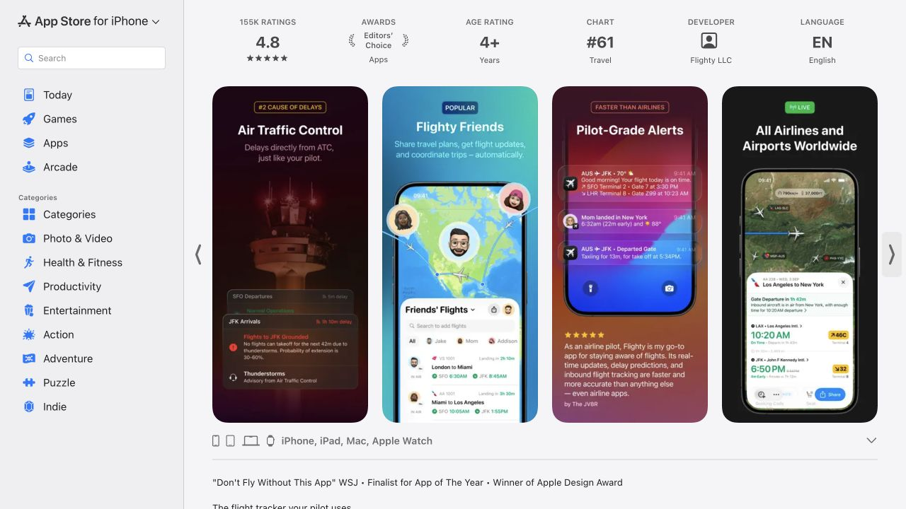

**3. Structured：商店截图的层级、裁切和品牌一致性**

[官网](https://structured.app/) · [App Store](https://apps.apple.com/us/app/structured-daily-planner-todo/id1499198946)

其官网含生活场景视频；商店素材采用一致的浅色底、大标题和界面放大。后段截图分别讲通知、习惯、跨设备和日历连接，每张有一个清楚的主主题。前段也有跨两张的手机构图，所以借鉴时仍要保证 RunBuoy 的每张图单独出现时能被理解。

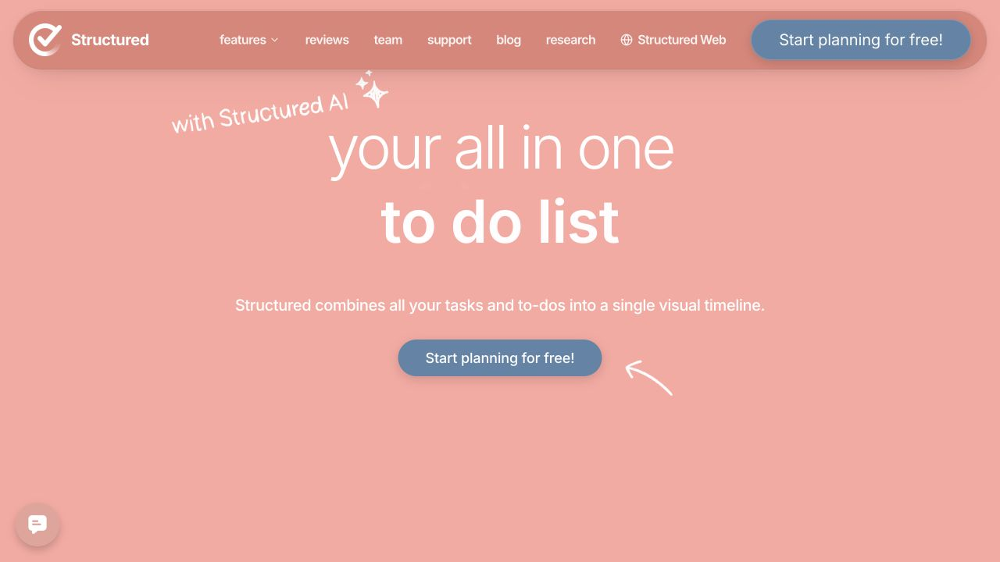

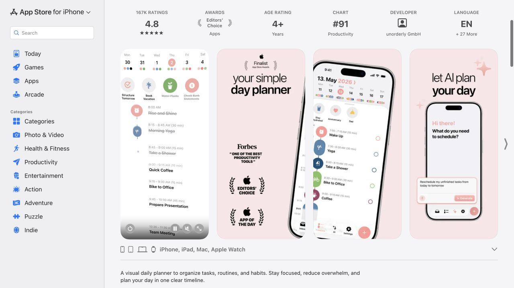

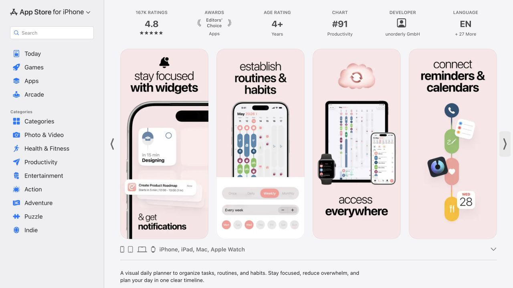

RunBuoy 可以保留自身蓝紫色，把它用于标题强调和少量背景。绿色、红色、橙色承担状态含义。建议统一每张图的标题位置、字号层级、手机比例和边距；文字以中文约 8–14 字为设计起点，在实际商店缩略尺寸下检查是否可读。

局部放大应来自真实界面。比如讲“阶段和剩余时间”时，就突出阶段、真实进度和来源提供的 ETA；无需同时让用户阅读所有机器字段、时间戳与消息。不要为了整齐而编造百分比。

Structured 的电影式首屏适合已有辨识度的品牌。RunBuoy 的首版宣传视频更适合 **终端启动任务 → 手机出现状态 → 任务结束收到结果** 的短演示；无需先投入生活方式广告拍摄。

**4. Pushcut：安装与接入教程的结构参考**

[官网](https://www.pushcut.io/) · [App Store](https://apps.apple.com/us/app/pushcut-shortcuts-automation/id1450936447) · [场景教程目录](https://www.pushcut.io/guides) · [具体教程示例](https://www.pushcut.io/guides/homekit-api-schedule-cancel)

教程目录用具体需求引导选择，详情页有编号步骤和侧边目录，结尾说明配置成功后会发生什么。它说明了技术产品的帮助内容如何承担“让用户第一次真正用上”的任务。

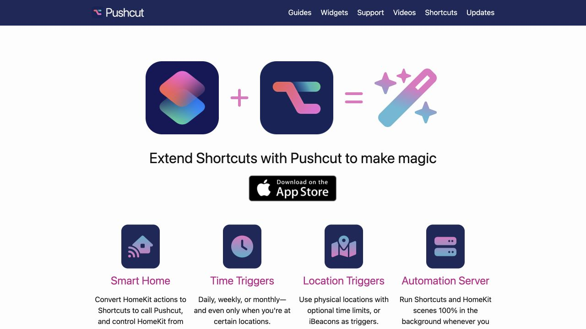

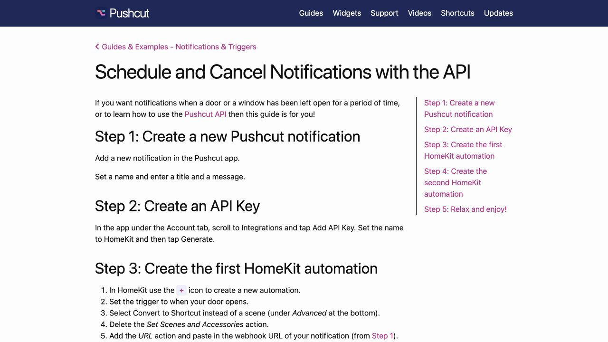

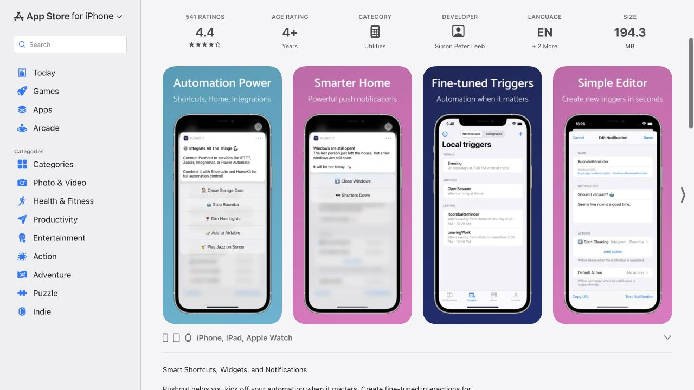

RunBuoy 的入门教程建议组织为四个可验证结果：

| 步骤 | 页面告诉用户做什么 | 用户如何知道成功 |
| --- | --- | --- |
| 1 | 在 iPhone 下载并打开 App | 能找到添加或配对机器入口 |
| 2 | 在 Mac / Linux 安装 CLI；可选交给 Agent 协助 | 安装检查通过 |
| 3 | 按已发布版本支持的方式配对电脑 | App 显示这台机器已连接 |
| 4 | 用户主动运行示例任务 | iPhone 确实显示任务与结果 |

每一步给出对应画面和常见问题。进入 API、SDK、自托管等说明之前，先完成第一次看见任务的闭环。这里建议改的是教程组织；具体命令和界面必须与最终用于宣传的已发布版本核对。Pushcut 的自动化动作、HomeKit 控制等不属于 RunBuoy 可宣传能力。

**5. Working Copy：给开发者的具体文案与演示**

[官网](https://workingcopy.app/) · [App Store](https://apps.apple.com/us/app/git-client-working-copy/id896694807)

它使用 Git 用户熟悉的工作流和动作，官网直接展示产品操作，商店图把连接代码托管、使用熟悉的编辑器和解决冲突分别呈现。这是技术产品降低解释成本的参考。

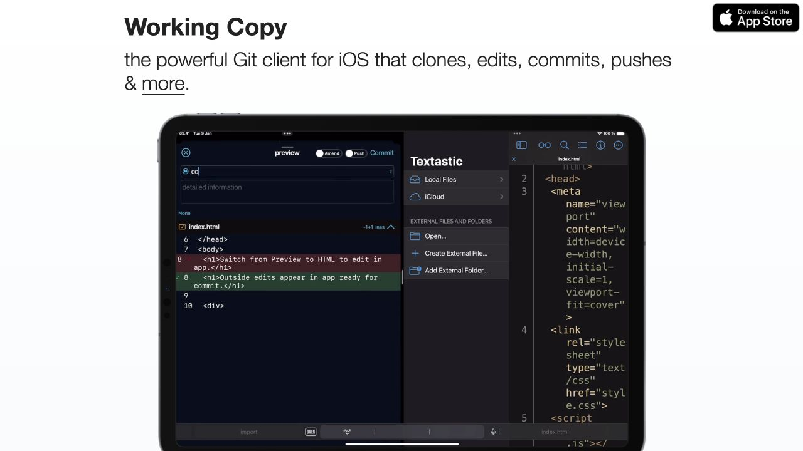

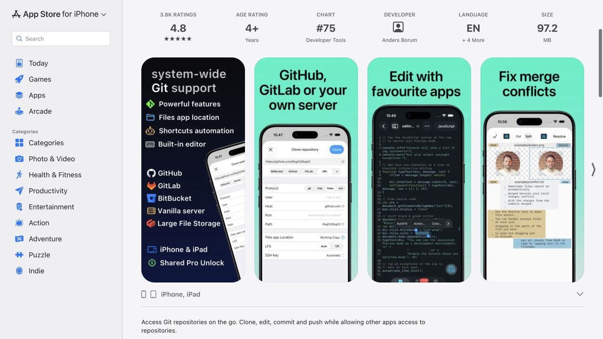

RunBuoy 应在收益之后迅速落到开发者熟悉的对象：“训练实验、构建、备份、长脚本”。演示一条任务即可：电脑启动，手机看到，结果到达。协议与安装机制放在需要时再解释。

它的第一张商店图信息较多，官网视觉也较朴素。这两点不宜照搬为 RunBuoy 的主视觉。

**6. 宣发素材组织：参考 Structured 的媒体包**

[官方官网链接的 Press Kit](https://impresskit.net/a94850d4-7d78-4ce2-ad8c-40841ebe2888) · [图片页](https://impresskit.net/a94850d4-7d78-4ce2-ad8c-40841ebe2888/images)

媒体包将产品文字、图片、视频、文件分开，图片有类型标签和分辨率下载。它更适合作为对外资料组织方式的参考；其中历史版本数据不能代替当前商店信息。

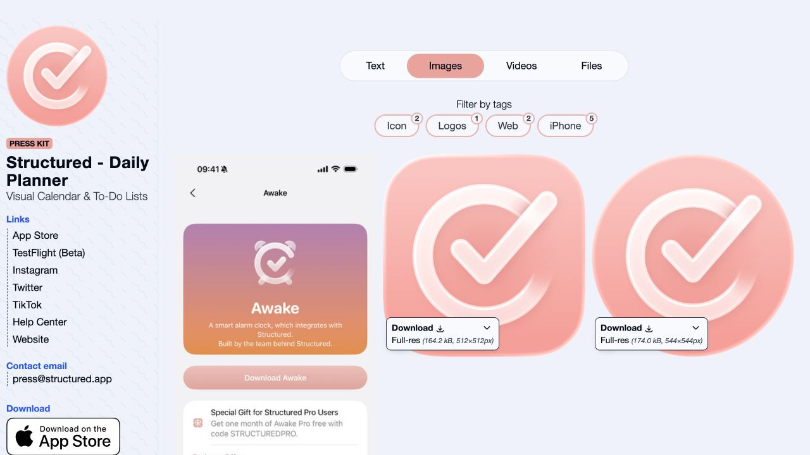

RunBuoy 的第一版媒体包可以很小：

- 中英文一句话介绍、短介绍和完整介绍。
- 浮标图标、横版 Logo、透明背景版本。
- 6 张商店宣传图，以及对应的真实 UI 原图。
- 一段约 20–30 秒的实际工作流演示，另外导出适合社交媒体的横版与竖版。
- App Store、官网、入门教程链接，以及明确的系统和接入要求。
- 联系方式、素材版本与更新日期。

**建议直接采用的 RunBuoy 内容骨架**

官网主标题：**离开电脑，也知道任务跑到哪了。**

副标题草案：**把训练、构建和长脚本的运行状态带到 iPhone。锁屏查看进度，完成或失败时收到提醒。**

技术补充放在首屏下方：任务需要接入 RunBuoy；百分比与 ETA 仅在任务提供相关数据时显示。官网不能让用户误以为安装 App 后即可自动发现任意电脑上的所有任务。

| 页面顺序 | 内容 | 主要参考 |
| --- | --- | --- |
| 首屏 | 收益标题、下载入口、连接电脑入口、放大锁屏卡片 | Chirp + Flighty |
| 第二屏 | 同一任务从运行到结果的 3 个状态 | Flighty |
| 第三屏 | 训练 / 构建 / 处理与备份三个具体案例 | Chirp + Working Copy |
| 第四屏 | 下载 App → 安装 CLI → 配对 → 看见示例 | Pushcut |
| 第五屏 | 数据发送边界、平台要求、常见问题 | RunBuoy 已核验的产品事实 |
| 页尾 | 下载、入门教程、支持、媒体包 | Structured |

商店六张图的建议脚本：

| 顺序 | 标题草案 | 要呈现的真实画面 |
| --- | --- | --- |
| 1 | 任务进度，锁屏可见 | 放大的 Live Activity 和必要的锁屏上下文 |
| 2 | 完成与失败，都有消息 | 完成、失败两种真实结果，避免装饰性假通知 |
| 3 | 几台电脑，一处掌握 | 有代表性任务的机器或任务列表 |
| 4 | 跑到哪一步，心里有数 | 阶段和任务实际提供的进度；支持时才放 ETA |
| 5 | 连接电脑，开始查看 | 实际配对步骤和已连接状态 |
| 6 | 清楚知道，哪些数据会发送 | 与隐私政策一致的简短边界说明及相关真实设置 |

先做中文和英文各一套内容，再校验整体构图。六张的价值顺序是建议，最终应结合目标用户的第一次理解和接入反馈调整。

**这一轮对前一轮建议的修正**

1. 将“改良截图”具体化为：放大关键状态、减少壁纸、增加收益标题、使用同一任务的连续叙事。
2. 将“官网更清楚”具体化为：来源与手机之间的关系图、三类场景、可完成的安装闭环。
3. 将“准备宣发”具体化为：官网、商店图、演示、教程与媒体包采用同一套表述。
4. 保留 RunBuoy 的原生工具气质。现阶段优先投入可读的状态和可信的演示；不需要复制参考产品的昂贵广告制作或复杂视觉效果。

**素材与证据说明**

本目录保存了 15 张浏览器实截、15 张官方商店宣传截图的网页尺寸版本、1 张预览视频封面和 10 份页面 DOM 快照。官方素材 URL 见 [asset-sources.json](./asset-sources.json)，网页与截图对应关系见 [参考来源.csv](./参考来源.csv)。

浏览器实截尺寸为 1280×720，商店素材是 Apple 网页实际加载的缩略尺寸，不能当作排版生产用的全分辨率素材。截图用于对照和设计研究，最终 RunBuoy 宣传使用自有图标、实机界面与文案。本文未修改 RunBuoy 网站、App Store 或产品代码。

前一轮 [RunBuoy 内容审查与建议](../content-audit/建议报告.md) 和 [建议文案](../content-audit/建议文案.md) 可与本报告一起使用。

